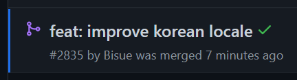

# 나의 첫 번째 오픈 소스 컨트리뷰트 (vuepress-theme-hope)

## vuepress-theme-hope

### 한국어 지원 관련 문제

지금 보고 있는 이 블로그를 만들기 위해 사용했던 vuepress-theme-hope 테마를 사용하던 중에,
테마 설정에서 언어를 한국어로 바꿨음에도 게시글의 '작성일' 부분이 영어 포맷으로 출력되고 있었다.

### 문제 해결과 첫 오픈소스 PR

테마 설정을 뭔가 빠뜨린게 있나 싶어서 한참을 구글링 했었는데 이 테마를 사용하는 한국인이 나 하나뿐인지 관련된 글은 찾을 수 없었다..

어쩔 수 없이 직접 작성일을 출력해주는 부분의 테마 코드를 거꾸로 타서 올라가 본 결과,
테마 내부 코드 중에 dayjs locale을 로딩하는 부분에 한국어 locale object 부분이 빠져있었다.
아무래도 테마 개발자가 실수로 빠뜨렸는데, 한국인 사용자가 없어서 아직 못 찾았던 듯 하다.

부랴부랴 한국어 dayjs locale object를 추가하고 짧은 영어로 번역기 돌려가며 떠듬떠듬 PR을 남겼다.  
(PR 템플릿이 따로 있나 찾아봤는데 해당 레포지토리에서는 따로 없는 것 같았다. 적당히 예쁘게 나눠서 적었다..)

밤 늦게 PR을 올려서 내일 쯤에 확인하려 했는데 바로 댓글이 달렸다.  
나중에 보니 테마 개발자가 중국인 개발자 분이였는데 시간대가 우리나라보다 1시간 느렸었다.

테마의 한국어 i18n이 번역기로 만들었었나보다.  
이 블로그를 만들 때도 약간 어색한 텍스트가 있어서 설정 파일에서만 수정해서 쓰고 있었는데,
테마 개발자가 댓글로 어색한 부분을 고쳐달라고 해서 내가 쓰던 부분을 원본 테마에도 추가로 수정해서 커밋했다.

### 머지 완료!

테마 개발자가 리뷰 해준 뒤에 이것저것 테스트랑 린터가 돌아가더니 내 PR이 머지되었다!

라이브러리 레포지토리 돌아다니면서 README Contributors에 올라가있는 사람들을 보면 뭔가 멋있어 보였는데,
내가 쓰는 오픈 소스 프로젝트에 쪼매난 i18n 지원 일부 수정이지만 PR을 보내고 머지된 걸 보니 나름 뿌듯하다.

이제 블로그 테마는 못 바꿀 것 같다.
