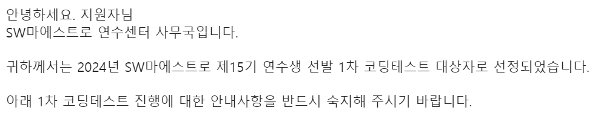
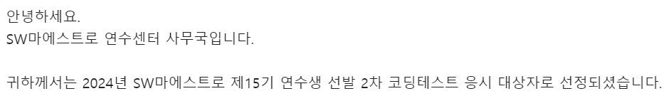

# SW마에스트로 15기 1차, 2차 코딩테스트 리뷰

::: note
**문제 유형**이나 **풀이 방법**에 대한 내용은 담지 않았다.

개인적인 기록 용도로 작성하는 글이니 유형이나 풀이를 보고 싶다면 읽지 마세요!
:::

## 신청

졸업 전 칼취업을 노렸지만, 아쉽게도 최종 면접에서 떨어지면서 2024년 상반기 채용을 노려야 하는 상황이 됐다.

코딩테스트, 프로젝트, 이력서/포트폴리오 정리를 진행하면서 상반기 채용 공고를 노리고 있었는데,
**SW마에스트로 15기** 모집이 열렸다는 소식을 듣고 지원했다.

SW마에스트로는 <b>서류 -(통과)-> 1차 코테 -(통과)-> 2차 코테 -(통과)-> 면접 -(통과)-> 선발(예비, 본 과정)</b>의 절차로 이루어지는 것 같았다.

서류는 결격 사유가 진짜 확실하게 있는게 아니면 웬만하면 통과를 시켜준다고 들었다.
이후 면접 과정에서 서류를 검토하는 방식인 듯 하다.

1차 코테 날짜 5일 정도 전에 서류 결과가 발표되었다.

## 1차 코딩테스트

서류 결과가 발표되고 5일 뒤인 토요일에 1차 코테를 봤다.

잔뜩 쫄아서 들어갔는데 생각보다 쉽게 풀렸다.
**일반적인 코딩테스트 알고리즘 문제가 4문제, SQL 문제가 1문제** 나왔다.

히든 테스트케이스에서 틀렸을 수도 있지만.. 제출은 5문제 다 했다.

코테를 토요일에 봤는데, 다음주 수요일에 바로 결과가 나왔다.

오픈 채팅을 보면 **특정 문제를 포함한 3솔 or 4솔**이 커트라인 인 것 같다.
이전 기수 회고를 보면 2~3솔이 커트라인 이었던 것 같은데, 이번 1차 코테가 유난히 쉽게 나온 것 같다.

## 2차 코딩테스트

2차 코테는 1차 코테 결과가 발표나온 주 토요일에 바로 봤다.

1차 코테가 생각보다 쉬웠어서 방심하고 들어갔는데.. 문제로 씨게 맞았다.

1차랑 똑같이 **알고리즘 4문제, SQL 1문제**가 나왔는데 1번 문제를 제외하고는 난이도가 꽤 높았던 것 같다.

나는 1번 문제와 5번 SQL 문제를 풀고, 2번 문제는 시간초과가 나는 방식으로 제출했고, 3번 문제는 테스트케이스만 맞는 방식으로 제출해뒀다.

시험이 끝나고 확인해본 결과, 3번은 너무 단순하게 생각해서 딱 예제만 통과하는 방식이라 틀렸고, 2번은 SW마에스트로의 채점 방식은 잘 모르겠지만 0~0.5솔로 치면 될 것 같았다.

결과적으로 나는 2차 코테에서 5문제 중 2~2.5솔을 한 것 같다.

<!-- 결과 나오면 작성 -->

아직 결과는 나오지 않았지만 3솔 이상은 해야 2차 코테를 붙을 것 같다..

(결과 나오면 추가 예정)
