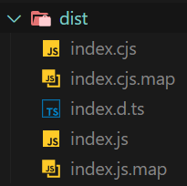

# NPM 라이브러리 배포 - 1) 독립형

## 개요

NPM 라이브러리 배포에 관심이 생겨, 배포하려는 라이브러리의 유형별로 배포 프로세스를 나름대로 정리하여 기록하려고 한다.

<!-- more -->

개인적인 분류 체계를 두어 라이브러리의 유형을 크게 두 가지로 나누어 구분하려고 한다.

1. 독립형
    - 다른 기반 패키지 없이 홀로 동작할 수 있는 라이브러리
2. 종속형
    - 다른 기반 패키지 위에서 동작하도록 작성된 라이브러리

이번 포스팅에서는 간단한 함수 몇 개가 포함된 독립형 모듈을 라이브러리화하여 배포하는 프로세스를 정리한다.

배포된 라이브러리는 `ESM` 및 `CommonJS`를 지원하고, `Typescript`를 지원하도록 구성할 것이다.

::: note 참고한 글
[간단한 유틸 함수 NPM 라이브러리 배포해보기 (feat. TypeScript 지원, ESM 지원)](https://junghyeonsu.com/posts/deploy-simple-util-npm-library/)
:::

## 목차

[[TOC]]

## 사전 준비

본격적으로 라이브러리를 작성하고 배포하기 전 필요한 몇가지 단계가 있다.

### NPM 계정 준비

NPM 패키지 매니저에 우리가 작성할 라이브러리를 배포할 것이므로, 배포의 주체가 될 NPM 계정을 준비해야 한다.

NPM 공식 홈페이지에서 일반적인 회원가입처럼 가입할 수 있다.

[NPM](https://www.npmjs.com/)

::: info Public vs Private


일반적으로 NPM 을 생각하면 Public 라이브러리만 떠오르지만, Private 라이브러리도 배포 가능하다.

다만, 기본적으로 Pullic 라이브러리 배포는 무제한 무료지만 Private 라이브러리를 배포하려면 Pro 이상의 라이센스를 구매해야 한다.

[NPM Pricing](https://www.npmjs.com/products)
:::

<!-- ::: info 일반 유저 vs 조직
[NPM 문서](https://docs.npmjs.com/organizations)
::: -->

### Node 개발 환경 준비

Node 기반 NPM 라이브러리를 배포할 계획이므로, Node 개발 환경이 필요하다.

본 포스팅에서는 다음과 같은 환경을 사용한다.

- Windows 11
- Node `v18.12.1`
- NPM `v8.19.2`

## 라이브러리 작성

사전 준비를 마쳤으면, 본격적으로 라이브러리를 작성해본다.

### NPM Init

개발할 라이브러리를 위한 디렉토리를 생성하고 해당 디렉토리로 이동한다.

```bash:no-line-numbers
mkdir bisue-utils
cd bisue-utils
```

라이브러리를 배포하려면 라이브러리의 이름, 버전 등의 해당 라이브러리에 대한 정보가 필요하다. 이들을 설정하기 위해서는 package.json 파일에 해당 정보를 기재하면 된다.

package.json 파일을 직접 만들 수도 있지만, npm init 명령을 통해 만들 수도 있다. npm init 명령을 통해 기본 package.json 파일을 생성한다.

```bash:no-line-numbers
# -y 옵션을 붙이면 기본 package.json 파일이 생성된다.
npm init -y
```

```json
{
  "name": "bisue-utils",
  "version": "1.0.0",
  "description": "",
  "main": "index.js",
  "scripts": {
    "test": "echo \"Error: no test specified\" && exit 1"
  },
  "keywords": [],
  "author": "",
  "license": "ISC"
}

```

생성된 package.json 파일의 내용을 입맛대로 바꾼다. 현재는 사용하지 않는 프로퍼티는 삭제하고 적절하게 수정한다.

```json {3-6}
{
  "name": "bisue-utils",
  "version": "0.0.1",
  "main": "src/index.js",
  "author": "Bisue",
  "license": "MIT"
}

```

::: info Semantic Versioning


NPM에서의 버전은 Semantic Versioning을 따르는 것을 권장하고 있다.

`.`으로 구분된 3가지 숫자는 뒤에서부터 Patch, Minor, Major 버전이다. 각 버전의 숫자는 아래와 같은 변경 사항이 발생할 때마다 대응되는 버전의 숫자를 증가시키고, 하위 버전의 숫자를 0으로 초기화하며 업데이트한다.

- Patch: (이전 버전과 호환 가능한) 버그 픽스
- Minor: (이전 버전과 호환 가능한) 기능 추가
- Major: (이전 버전과 호환 불가능한) 변경 사항

[Semantic Versioning](https://semver.org/lang/ko/) [NPM Semantic Versioning](https://docs.npmjs.com/about-semantic-versioning)
:::

### 코드 작성

이제 라이브러리화 하려는 모듈의 코드를 작성한다.

라이브러리 디렉토리 내에서 어느 경로에 작성해도 상관없지만, 편의를 위해 소스코드를 모아두는 src/ 디렉토리를 만들어 해당 디렉토리 내부에 모듈 코드를 작성하겠다.

이번 포스팅에서는 `add`, `subtract`, `multiply`, `divide`의 4가지 간단한 함수를 포함한 모듈을 예시로 작성한다.

```javascript
// src/index.js
function add(a, b) {
  return a + b;
}

function subtract(a, b) {
  return a - b;
}

function multiply(a, b) {
  return a * b;
}

function divide(a, b) {
  return a / b;
}

// commonjs export
module.exports = {
  add,
  subtract,
  multiply,
  divide,
};
```

### 로컬 배포 및 테스트

개요에서 언급했던 아래 조건을 무시하면, 사실 라이브러리 배포를 위한 필수 조건은 다 갖추었다.

> 배포된 라이브러리는 `ESM` 및 `CommonJS`를 지원하고, `Typescript`를 지원하도록 구성할 것이다.

그럼 현재 상태로 그냥 배포하면 안되는 걸까?

실제로 테스트 해보자. NPM에 배포하지 않아도 로컬에서 개발한 패키지를 사용해볼 수 있다.

모듈 디렉토리에서 다음 명령을 실행하여 NPM의 global 라이브러리가 설치된 폴더에 현재 폴더의 symbolic link를 생성한다.

```bash:no-line-numbers
npm link
```

::: note npm link 이해하기
npm link의 동작 방식을 좀 더 알아보고 싶다면 아래 글에 잘 정리되어 있다.

[Understanding npm-link](https://medium.com/dailyjs/how-to-use-npm-link-7375b6219557)
:::

이제 우리의 라이브러리를 사용할 클라이언트 단 코드를 작성해보자.

임의의 다른 디렉토리로 이동하고 package.json 을 작성한다.

```bash:no-line-numbers
cd ..
mkdir client
cd client
npm init -y
```

```json
// package.json
{
  "name": "client",
  "version": "0.0.1",
  "main": "index.js",
  "license": "MIT"
}
```

이후 아래 명령을 통해 앞서 생성한 라이브러리를 의존성에 추가한다.

```bash:no-line-numbers
npm link bisue-utils
```

테스트를 위해 라이브러리를 사용하는 클라이언트 코드를 작성한다.

```javascript
// index.js
// commonjs import
const { add, divide, multiply, subtract } = require("bisue-utils");

console.log(add(2, 1));
console.log(subtract(2, 1));
console.log(multiply(2, 1));
console.log(divide(2, 1));
```

작성한 클라이언트 코드를 실행하여 라이브러리가 잘 동작하는지 확인한다.

```bash:no-line-numbers
node index.js
```

```bash:no-line-numbers
3
1
2
2
```

잘 동작한다! 그러나 지금의 라이브러리는 문제가 많이 존재한다.

지금의 상황은 라이브러리 내 모듈이 CommonJS 방식으로 export 하고, 클라이언트도 CommonJS 방식으로 import 하는 방식이다.

그렇다면 클라이언트가 일반적으로 많이 사용하는 ESM 방식으로 import 하면 어떻게 될까?

```json {4}
// package.json
{
  "name": "client",
  "version": "0.0.1",
  "type": "module",
  "main": "index.js",
  "license": "MIT"
}
```

```javascript {2-3}
// index.js
// esm import
import { add, divide, multiply, subtract } from "bisue-utils";

console.log(add(2, 1));
console.log(subtract(2, 1));
console.log(multiply(2, 1));
console.log(divide(2, 1));
```

```bash
node index.js
```

```bash:no-line-numbers
3
1
2
2
```

역시 잘 동작한다!

그러면 이제 라이브러리 디렉토리로 돌아와서, export 방식을 ESM으로 변경해보자.

```javascript {18-24}
// src/index.js
function add(a, b) {
  return a + b;
}

function subtract(a, b) {
  return a - b;
}

function multiply(a, b) {
  return a * b;
}

function divide(a, b) {
  return a / b;
}

// esm export
export {
  add,
  subtract,
  multiply,
  divide,
};
```

다시 클라이언트 디렉토리로 돌아와서 실행해보자.

```bash
node index.js
```

```bash:no-line-numbers
3
1
2
2
```

잘 동작한다.

마지막으로 클라이언트를 다시 CommonJS 방식으로 바꿔보자.

```json
// package.json
{
  "name": "client",
  "version": "0.0.1",
  "main": "index.js",
  "license": "MIT"
}
```

```javascript
// index.js
// commonjs import
const { add, divide, multiply, subtract } = require("bisue-utils");

console.log(add(2, 1));
console.log(subtract(2, 1));
console.log(multiply(2, 1));
console.log(divide(2, 1));
```

```bash:no-line-numbers
node index.js
```

```plaintext:no-line-numbers
ReferenceError: require is not defined in ES module scope, you can use import instead
This file is being treated as an ES module because it has a '.js' file extension and '...' contains "type": "module". To treat it as a CommonJS script, rename it to use the '.cjs' file extension.
```

이번에는 오류가 발생한다!

위 케이스들을 정리하면 다음과 같다.

| 라이브러리      | 클라이언트      | 결과 |
| --------------- | --------------- | ---- |
| CommonJS export | CommonJS import | O    |
| CommonJS export | ESM import      | O    |
| ESM export      | ESM import      | O    |
| ESM export      | CommonJS import | X    |

요약하면 라이브러리 내부 코드에서 ESM을 사용하면 CommonJS를 사용하는 클라이언트를 지원할 수 없게 된다.

따라서 라이브러리 내부에서 ESM을 사용하고 싶다면, 추가적인 작업이 필요하다.

## ESM 및 CommonJS 지원

라이브러리가 ESM과 CommonJS 방식의 클라이언트를 모두 지원하기 위해서는 CommonJS 방식의 export를 사용하는 파일, ESM 방식의 export를 사용하는 파일을 별도로 두고 package.json에 `exports` 프로퍼티로 명시해주어야 한다.

```javascript {1,18-24}
// src/index.cjs
function add(a, b) {
  return a + b;
}

function subtract(a, b) {
  return a - b;
}

function multiply(a, b) {
  return a * b;
}

function divide(a, b) {
  return a / b;
}

// commonjs export
module.exports = {
  add,
  subtract,
  multiply,
  divide,
};
```

```javascript {1,18-24}
// src/index.cjs
function add(a, b) {
  return a + b;
}

function subtract(a, b) {
  return a - b;
}

function multiply(a, b) {
  return a * b;
}

function divide(a, b) {
  return a / b;
}

// esm export
export {
  add,
  subtract,
  multiply,
  divide,
};
```

```json {7-12}
// package.json
{
  "name": "bisue-utils",
  "version": "0.0.1",
  "type": "module",
  "main": "index.js",
  "exports": {
    ".": {
      "import": "./src/index.js",
      "require": "./src/index.cjs",
    }
  },
  "author": "Bisue",
  "license": "MIT"
}
```

`exports` 프로퍼티는 다음과 같이 구성된다.

```json
{
    "SUB_PATH": {
        "types": "PATH_D.TS",
        "import": "PATH_ESM",
        "require": "PATH_CJS"
    }
}
```

`SUB_PATH`는 라이브러리를 import 할 때 `라이브러리명/SUB_PATH` 처럼 경로를 지정할 때 사용된다. 현재 라이브러리는 별도의 서브 경로를 두지 않을 것이므로 현재 디렉토리를 나타내는 `.`을 사용한다.

`types`는 이후 타입스크립트 지원을 추가할 때 `d.ts` 파일의 경로를 지정하는데 사용된다. 이 단계에서는 사용하지 않는다.

`import`는 ESM 방식의 export를 사용하는 파일 경로를 지정하는데 사용된다.

`require`는 CommonJS 방식의 export를 사용하는 파일 경로를 지정하는데 사용된다. 일반적으로 `.cjs` 확장자를 사용한다.

::: note exports 더 알아보기
exports에 사용할 수 있는 프로퍼티는 더 많이 있다. 더 알아보고 싶다면 아래 문서를 참고하면 좋다.

[Node - Conditional Exports](https://nodejs.org/api/packages.html#conditional-exports)
:::

이제 우리의 라이브러리는 CommonJS와 ESM 방식 모두 사용가능하다.

다만 CommonJS 방식과 ESM 방식의 코드를 모두 직접 관리해야 하는 점이 마음에 걸린다.

이 부분은 타입스크립트 지원을 추가하면서 동시에 해결해본다.

## 타입스크립트 지원

현재 우리의 라이브러리는 타입스크립트를 사용하는 클라이언트에서 사용할 수 없다.

상황을 파악해보기 위해 타입스크립트 환경의 클라이언트를 구성해보자.

이전에 만들어놓았던 클라이언트 디렉토리로 이동하여 타입스크립트 환경을 구성한다.

```bash:no-line-numbers
npm i -D typescript ts-node
npx tsc --init
```

```json {2-4}
// tsconfig.json
{
  "ts-node": {
    "esm": true
  },
  "compilerOptions": {
    "target": "es2016",
    "module": "commonjs",
    "esModuleInterop": true,
    "forceConsistentCasingInFileNames": true,
    "strict": true,
    "skipLibCheck": true
  }
}

```

```json {5-13}
// package.json
{
  "name": "client",
  "version": "0.0.1",
  // "type": "module",
  "main": "index.ts",
  "dependencies": {
    "bisue-utils": "^0.0.1",
    "ts-node": "^10.9.1",
    "typescript": "^5.2.2"
  },
  "scripts": {
    "start": "ts-node index.ts"
  },
  "author": "Bisue",
  "license": "MIT"
}
```

```typescript
// index.ts
// esm import
import { add, divide, multiply, subtract } from "bisue-utils";

console.log(add(2, 1));
console.log(subtract(2, 1));
console.log(multiply(2, 1));
console.log(divide(2, 1));
```

```bash:no-line-numbers
npm run start
```

```plaintext:no-line-numbers
error TS2307: Cannot find module 'bisue-utils' or its corresponding type declarations.
```

현재 우리의 라이브러리는 타입과 관련된 정보를 전달하는 파일이 존재하지 않아 타입스크립트 환경에서 사용하면 문제가 발생한다.

### 타입 정보(d.ts) 추가

타입 정보를 추가하기 위해, 라이브러리 디렉토리로 이동하여 타입스크립트를 의존성에 추가한다. 추가로 node 내장 모듈의 타입도 같이 추가한다.

```bash:no-line-numbers
npm i -D typescript @types/node
```

이어서 tsconfig.json 파일도 추가해준다.

```json
{
  "compilerOptions": {
    "target": "es6",
    "module": "commonjs",
    "lib": [
      "es5",
      "es6",
      "dom"
    ],
    "declaration": true, // 타입 정보(d.ts) 생성 여부
    "outDir": "dist", // 컴파일 결과 디렉토리
    "strict": true
  },
  "include": ["src/index.ts"] // 컴파일 대상
}
```

라이브러리의 코드를 타입스크립트로 변경한다.

```typescript {1-2,6,10,14}
// src/index.ts
function add(a: number, b: number) {
  return a + b;
}

function subtract(a: number, b: number) {
  return a - b;
}

function multiply(a: number, b: number) {
  return a * b;
}

function divide(a: number, b: number) {
  return a / b;
}

// esm export
export {
  add,
  subtract,
  multiply,
  divide,
};
```

package.json에 빌드 스크립트를 추가하고, 실행한다.

prepack 스크립트는 NPM 배포 명령인 npm publish 명령 실행 시 자동으로 실행되는 명령이다.

```json {3-7}
{
    // ...
    "scripts": {
        "prepack": "npm run build",
        "build": "npm run build:tsc",
        "build:tsc": "npx tsc"
    },
    // ...
}
```

```bash:no-line-numbers
npm run build
```

package.json의 main 및 exports 프로퍼티의 경로를 수정한다.

```json {5,12-13}
{
  "name": "bisue-utils",
  "version": "0.0.1",
  "main": "dist/index.js",
  "scripts": {
    "build": "npm run build:tsc",
    "build:tsc": "npx tsc"
  },
  "exports": {
    ".": {
      "types": "./dist/index.d.ts",
      "import": "./dist/index.js",
      "require": "./src/index.cjs"
    }
  },
  "author": "Bisue",
  "license": "MIT",
  "devDependencies": {
    "@types/node": "^20.8.8",
    "typescript": "^5.2.2"
  }
}
```

이제 타입스크립트 지원이 추가되었다.

하지만 현재는 ESM으로만 컴파일되고, CommonJS는 따로 관리된다. 통합적으로 관리할 수 있도록 설정해보자.

### 타입스크립트 -> ESM/CommonJS

#### 1) ESBuild

하나의 타입스크립트 파일로부터 ESM 및 CommonJS 방식의 js 파일을 컴파일 하는 방법은 다양하다.

본 포스팅에서는 ESBuild를 사용하여 컴파일 프로세스를 구성해본다.

이를 위해 먼저 ESBuild를 라이브러리의 devDependencies에 추가한다.

```bash:no-line-numbers
npm i -D esbuild
```

이후 다소 복잡한 빌드 프로세스를 CLI 대신 스크립트 파일로 관리하기 위해 `build.js` 파일을 생성하여 작성한다.

```js
// build.js
import esbuild from "esbuild";

const baseConfig = {
  entryPoints: ["src/index.ts"], // 컴파일 대상
  outdir: "dist", // 컴파일 위치
  bundle: true, // 번들링 여부
  sourcemap: true, // 소스맵 생성 여부
};

Promise.all([
  // cjs
  esbuild.build({
    ...baseConfig,
    format: "cjs",
    outExtension: {
      ".js": ".cjs",
    },
  }),

  // esm
  esbuild.build({
    ...baseConfig,
    format: "esm",
  }),
]).catch(() => {
  console.log("Build failed...");
  process.exit(1);
});

```

스크립트를 살펴보면, `baseConfig`는 CommonJS와 ESM 방식의 컴파일 모두에서 사용할 ESBuild 옵션을 설정하고 있다.

`entryPoints` 옵션은 컴파일을 시작할 시작점이 될 스크립트들을 지정한다.  
`outdir` 옵션은 컴파일이 끝난 js 파일이 저장될 경로를 지정한다.  
`bundle` 옵션은 각 파일에서 import로 사용한 코드들을 모두 inline 형태로 가져와 단일 파일에 저장하는 기능의 활성화 여부를 지정한다. 기본값은 `false` 이다.  
`sourcemap` 옵션은 각 결과 파일의 소스맵을 생성하는 기능의 활성화 여부를 지정한다.

이후 `build` 메서드를 이용하여 CommonJS, ESM 방식의 컴파일을 총 2번 진행한다. 해당 메서드는 Promise를 반환하므로 두 빌드가 모두 완료될 때 까지 대기하기 위해 `Promise.all` 메서드로 대기한다.

CommonJS 빌드에서는 `format` 옵션을 `cjs`로 설정해주고, 결과물의 확장자를 `.cjs`로 변경한다.

ESM 빌드에서는 `format` 옵션을 `esm`으로 설정한다.

빌드 스크립트 작성이 완료되었으므로, 이를 이용하여 라이브러리를 빌드하는 스크립트를 `package.json`에 추가한다.

```json {6-10,16,24}
{
  "name": "bisue-utils",
  "version": "0.0.1",
  "main": "dist/index.js",
  "scripts": {
    "prepack": "npm run build",
    "clean": "npx rimraf dist",
    "build": "npm run clean && npm run build:tsc && npm run build:js",
    "build:tsc": "npx tsc --emitDeclarationOnly",
    "build:js": "node build.js"
  },
  "exports": {
    ".": {
      "types": "./dist/index.d.ts",
      "import": "./dist/index.js",
      "require": "./dist/index.cjs"
    }
  },
  "author": "Bisue",
  "license": "MIT",
  "devDependencies": {
    "@types/node": "^20.8.8",
    "esbuild": "^0.19.5",
    "rimraf": "^5.0.5",
    "typescript": "^5.2.2"
  }
}
```

빌드를 진행하기 전 이전 빌드 결과물을 모두 삭제하여 깨끗한 빌드를 수행하기 위해 `clean` 스크립트를 추가하였다. 이때, 운영체제에 독립적인 동작을 위해 `rimraf` 라이브러리를 `devDependencies`에 추가하여 사용한다.

```bash:no-line-numbers
npm i -D rimraf
```

또한 현재 ESBuild는 타입 정보인 `d.ts` 컴파일을 지원하지 않기 때문에 CommonJS, ESM 방식 `js` 파일 생성을 위해서는 ESBuild를 사용하되, `d.ts` 생성을 위해서는 기존 tsc를 사용해야 한다.

따라서 기존 `build:tsc` 스크립트는 `emitDeclarationOnly` 옵션을 추가하여 타입 정보만 컴파일하도록 수정한 뒤, 앞서 작성한 build.js 파일을 실행하여 ESBuild 컴파일을 진행하는 build:js 스크립트를 추가한다.

이후 `clean` 스크립트를 수행하여 `dist` 디렉토리를 삭제한 뒤, `build:tsc`와 `build:js` 스크립트를 모두 수행하는 `build` 스크립트를 추가한다.

`prepack` 스크립트는 패키지를 압축하는 `npm pack`, `npm publish` 스크립트가 실행되기 전 자동으로 실행되는 스크립트이다.

마지막으로 CommonJS 파일의 경로를 지정하는 `exports`의 `require` 옵션을 기존 `src` 내 `.cjs` 파일에서 생성할 `dist`의 `.cjs` 파일로 변경한다. `src` 경로 내 존재했던 `.cjs` 파일은 더 이상 필요없으니 삭제한다.

스크립트 추가가 완료되었으면 `build` 스크립트를 실행하여 컴파일이 잘 수행되는지 확인한다.

```bash:no-line-numbers
npm run build
```



CommonJS, ESM, 소스맵, 타입 정보가 모두 생성됨을 확인할 수 있다.

#### 2) Others

(ESBuild 이외의 가능한 방법에 대해 작성중)

### NPM 배포

이제 모든 준비가 끝났다.

NPM에 배포하기 전 `package.json`에서 마지막으로 설정해줘야 할 옵션이 있다.

```json
// package.json
{
  // ...
  "files": [
    "dist",
    "src"
  ]
  // ...
}
```

`files` 옵션은 배포될 NPM 패키지에 포함될 파일/폴더를 지정해주는 옵션이다. `dist` 폴더는 당연히 포함되어야 하고, `src` 폴더는 원본 소스 코드를 확인하고자 하는 사용자를 위해 포함한다.

이제 드디어 NPM에 배포를 진행한다.

배포 전, 가장 처음에 만들었던 NPM 계정으로 로그인을 해야한다.

```bash:no-line-numbers
npm login
```

로그인 한 뒤, 다음 명령을 통해 배포한다.

::: info 버전 업
배포 전 버전을 수정하려면 package.json에서 직접 변경해도 되지만, 명령어를 통해서 쉽게 변경할 수도 있다.

```bash:no-line-numbers
npm version major # major 버전 업 (minor, patch 0으로 초기화)
npm version minor # minor 버전 업 (patch 0으로 초기화)
npm version patch # patch 버전 업
```
:::

```bash:no-line-numbers
npm publish
```

NPM 배포가 완료되었다!

이제 NPM 홈페이지에 로그인하면 자신이 배포한 라이브러리를 확인할 수 있고, 다른 NPM 라이브러리처럼 설치할 수 있다.
