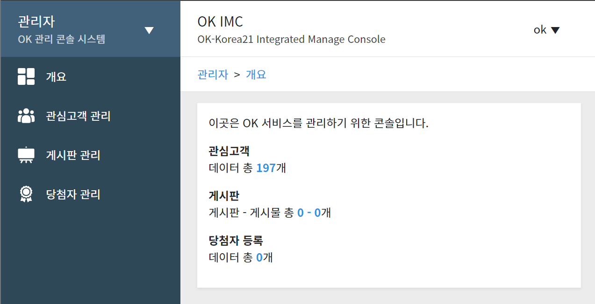
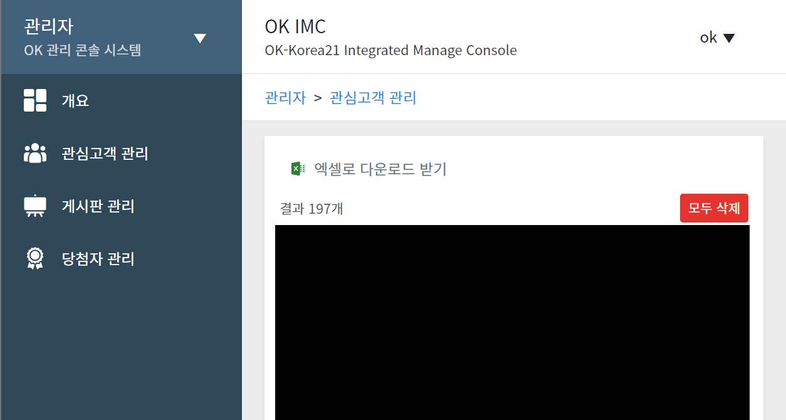
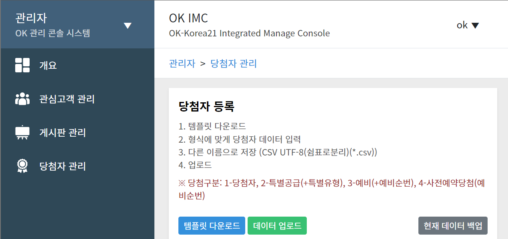

# Laravel Wrapper

> 분양 사이트를 위한 관심고객등록, 당첨자조회 등 관리자 콘솔 시스템

## 스크린샷

<Screenshots>

</Screenshots>

## 개요

'Laravel Wrapper'는 '(주)Okkorea21'의 요청을 받아 제작한 분양 사이트 제작용 관리자 콘솔이 포함된 Laravel 기반 분양사이트 시스템입니다.

분양 사이트 특성 상, 건설사의 요청을 받고 <TextHighlight>단기간</TextHighlight>에 비교적 <TextHighlight>고정된 기능</TextHighlight>의 사이트를 빠르게 만들어 제공해야합니다. 또한 분양이 진행되는 동안의 <TextHighlight>짧은 기간동안만 호스팅</TextHighlight>되고 빠르게 내려갑니다.

빠르게 제작해야하고, 고정된 기능을 가지며, 짧은 기간만 호스팅되어 다른 프로젝트들보다 빠른 주기를 가지고 사이트를 개발해야되는 특성이 있어, 분양 사이트 개발을 위해 주로 들어가는 일정 기능을 포함한 시스템을 만들었습니다.

::: note 개발 기간
2020년 01월 ~ 2020년 04월
:::

::: note 사용 기간
2020년 03월 ~ (현재)
:::

## 인원

개발은 프론트엔드, 백엔드 모두 혼자 진행하였으며, 기능 요구 및 디자인 시안은 '(주)Okkorea21'이 제공하였습니다.

## 주요 기능

- 관리자 콘솔
  - 기능 On/Off
    - 아래 기술한 기능들을 각각 켜고 끌 수 있는 기능  
      (게시판 관리/관심고객 관리/팝업 관리/당첨자 관리)
  - 관리자 권한 분할
    - 최종 관리자
    - 일반 관리자
  - 팝업 노출 관리 (일반관리자)
    - 사이트 메인페이지에서 노출시킬 팝업 등록
    - 팝업 노출 순서 관리
    - 팝업 비공개
  - 게시판 관리
    - 게시판 생성/관리 (최종관리자)
      - 게시판 타입 구분
        - 기본형
        - 갤러리형
        - 외부 링크형
        - 블로그형
        - QnA형
    - 게시글 작성 (일반관리자)
      - Wysiwyg 에디터
      - 파일 첨부
  - 관심고객 관리 (일반관리자)
    - 관심고객 조회
      - 엑셀로 내보내기 기능
  - 당첨자 관리 (일반관리자)
    - 당첨자 정보 업로드: 엑셀 형식 지원
- 기본 사이트 기능/레이아웃 (사용자 측면)
  - 관심고객 등록 기능
    - 기본적인 관심고객 등록 폼
  - 게시판 조회
    - 타입 별로 다른 게시판 레이아웃
  - 당첨자 조회 기능
    - 본인의 정보 입력 후 당첨자 여부 조회

## 기술 스택

- Laravel
- Vue(partial)
- Google Cloud Platform

## 링크

::: info
아래 사이트들은 본 Laravel Wrapper 템플릿을 이용해 제작한 분양 사이트입니다.

(아래 사이트 또한 모두 제가 '(주)Okkorea21' 요청을 받아 제작한 사이트입니다.)
:::
::: note
연결이 되지 않는 사이트는 기한이 종료되어 유지보수가 끝난 사이트일 수 있습니다.  
주기적으로 유지보수가 끝난 프로젝트는 내리고 있습니다.
:::

[하남 에클라56](https://www.xn--56-hz8ii78bfrm.com/)

[더하이클래스](https://www.xn--9m1by4fo7l0yef3mu8g.com/)

[염창동 H밸리움2](https://www.xn--h2-id0j87fgyt.com/)

[남양주 진접 사랑으로부영](http://jinjeop.sarangeuro.co.kr/)

[우정교육 문화재단](http://www.woojungedu.co.kr/)

[춘천 벨라시티](https://www.ccbellacity.co.kr/)

[대청천 경동 리인뷰](http://xn--289at2jwsay4p9zfjsqdpi4d.com/)

등 다수 분양 사이트 제작

