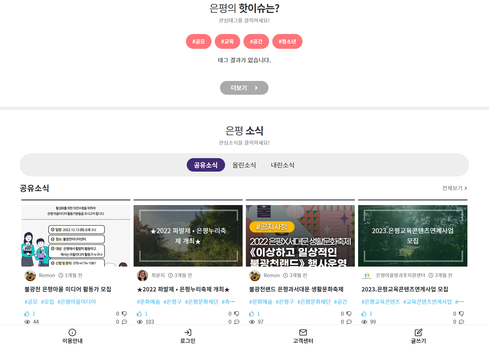

# 은평알리미

> 은평구 지역 소식 공유 플랫폼

## 개요

'은평알리미'는 협동조합 '은평공리사회적협동조합'의 요청을 받아 제작한 은평구 지역 소식 공유 플랫폼입니다.

::: note 개발 기간
2019년 11월 ~ 2020년 04월
:::

::: note 운영 기간
2020년 04월 ~ (현재)
:::

## 인원

개발은 프론트엔드, 백엔드 모두 혼자 진행하였으며, 기능 요구 및 디자인 시안은 '은평공리사회적협동조합'이 제공하였습니다.

## 주요 기능

- 카카오 소셜로그인
- 지역 소식 링크 공유 (글쓰기)
  - 제공된 링크의 썸네일 가져오기
- 댓글 기능
- 태그 기능
  - 태그 별 소식 모아보기
- 참여 기능 (올려요/내려요)
  - 올려요가 더 많은 게시글만 비회원들에게 보임
  - 내려요가 더 많은 게시글은 회원들에게만 보임 (비회원들에겐 블라인드 처리)
- 카카오톡 공유 기능 (카카오톡 메시지 API)

## 기술 스택

- Laravel
- Vue(partial)
- Google Cloud Platform
- Kakao API

## 스크린샷

## 링크

[은평알리미(epalimi.com)](https://epalimi.com)
