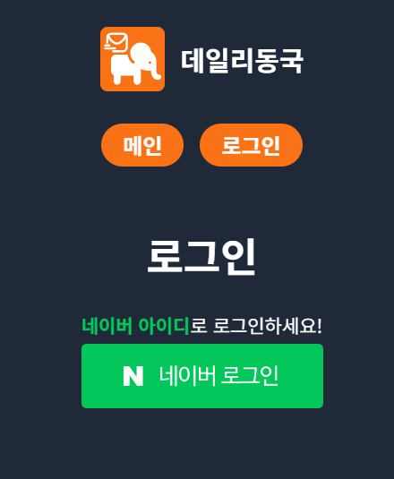
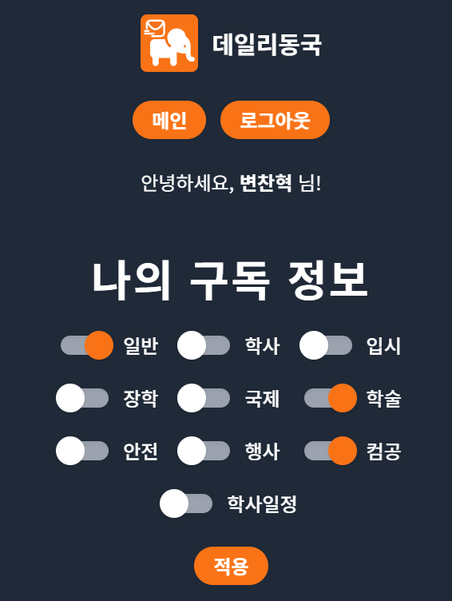
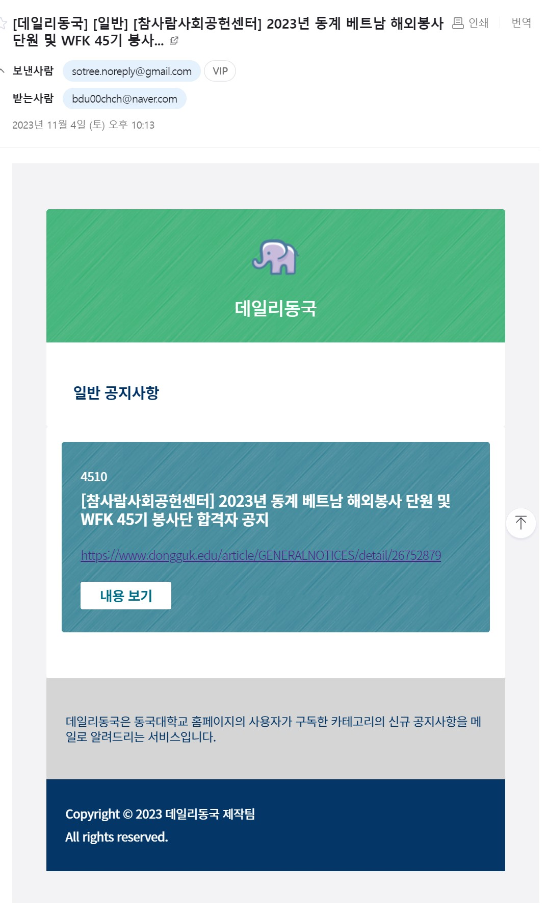

# 데일리동국 - 동국대 공지사항 알림 서비스

> 동국대학교의 카테고리별 신규 공지사항을 구독자들에게 알려주는 서비스입니다.

## 스크린샷

<Screenshots>
    
    
    
</Screenshots>

## 개요

'데일리동국'은 동국대학교 홈페이지에 게시되는 각 카테고리별 신규 공지사항들을
각 카테고리를 구독하는 사용자들에게 메일로 전달해주는 서비스입니다.

::: note 개발 기간
2023년 02월 ~ 2023년 3월
:::

## 인원

- 프론트엔드+백엔드 1인, 백엔드 1인 (총 2인)
- 프론트엔드 전반+백엔드 일부를 담당

## 주요 기능

- 소셜 로그인
  - 네이버 로그인
  - 카카오 로그인(추가 중)
- 구독 카테고리 갱신
- 주기적 공지사항 크롤링
  - 신규 공지사항 판별
- 신규 공지사항 메일링
  - EJS 기반 메일 템플릿 렌더링

## 기술 스택

- Nuxt 3
- Vue 3 (composition api)
- Typescript
- NestJS

