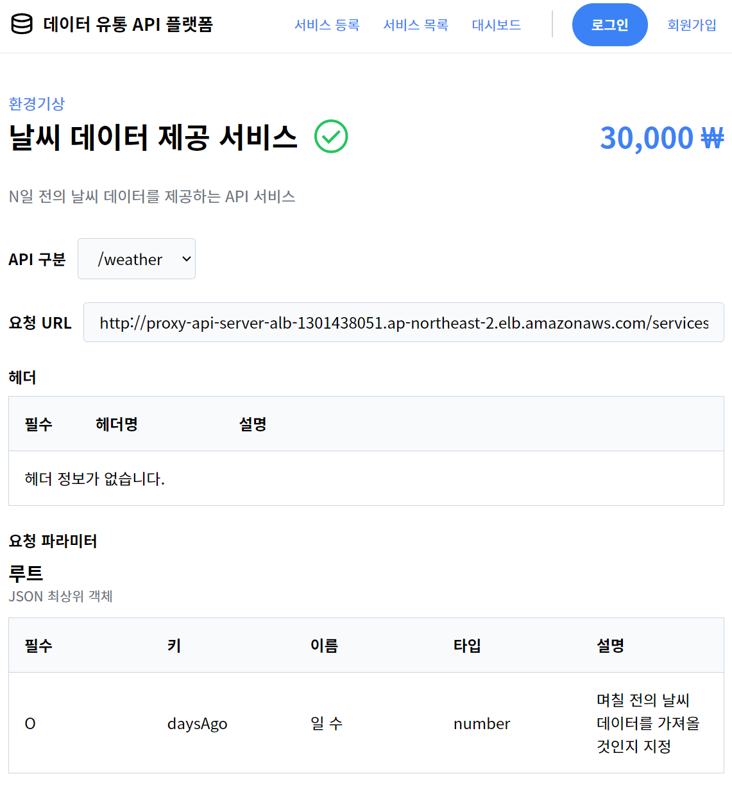

# 2023 한이음ICT 멘토링 & 공모전

> "자동검수 기반 데이터유통 API 플랫폼" 

## 스크린샷

<Screenshots>

</Screenshots>

## 개요

2023 한이음ICT 멘토링에 "데이터유통 API 플랫폼 개발"이라는 주제로 참여하여 <TextHighlight>입선작</TextHighlight>으로 선정되었습니다.

::: note 개발 기간
2023년 04월 ~ 2023년 11월
:::

## 인원

- 백엔드 3인, 프론트엔드 2인, (총 5인)
- 프론트엔드 전반을 담당

## 주요 기능

- API 등록/수정
  - JSON Schema를 이용한 API 명세 작성
  - API 등록/수정 시 자동 API 검수
    - 서버에서 대상 제 3자 API로 모의 호출 후, 응답 데이터를 기입된 명세 기반으로 검증
- API 조회/구매
  - JSON Schema를 이용한 API 명세 테이블 형식 조회
  - API 상태 조회
  - API 구매 및 키 조회
  - 이상 API 신고
- API 대시보드
  - API 사용량 조회/제한
  - API 에러 로그 조회
- API 중계 서버
  - API 키 발급
  - API 사용량 집계 및 제한
  - API 호출

## 기술 스택

- Next 13
- React 18
- Typescript

