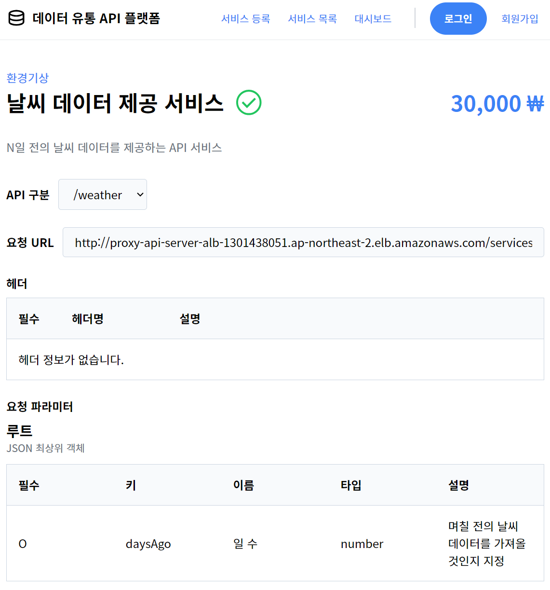
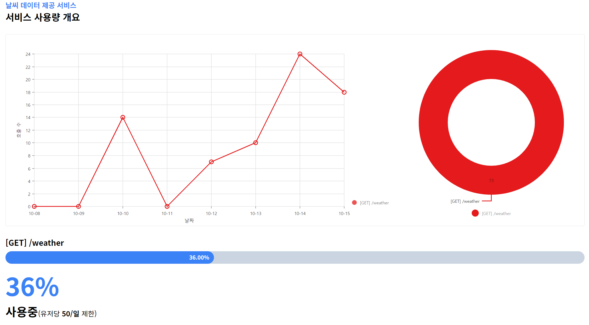

# 2023 한이음ICT 멘토링 & 공모전

> "자동검수 기반 데이터유통 API 플랫폼" 

## 스크린샷

<Screenshots>

</Screenshots>

## 개요

2023 한이음ICT 멘토링에 "데이터유통 API 플랫폼 개발"이라는 주제로 참여하여 <TextHighlight>입선작</TextHighlight>으로 선정되었습니다.

::: note 개발 기간
2023년 04월 ~ 2023년 11월
:::

## 인원

- 백엔드 3인, 프론트엔드 2인, (총 5인)
- 프론트엔드 전반을 담당

## 주요 기능

- 

## 기술 스택

- Next 13
- React 18
- Typescript

