# 2021 군 장병 공개SW 해커톤

> "군 장병 미용시설 예약 및 리뷰 웹 서비스"

## 스크린샷

<Screenshots>

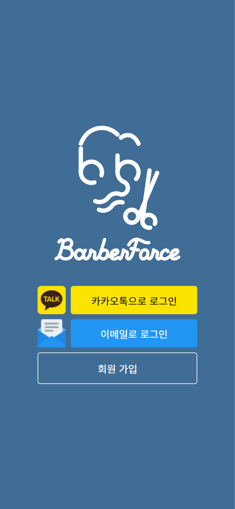
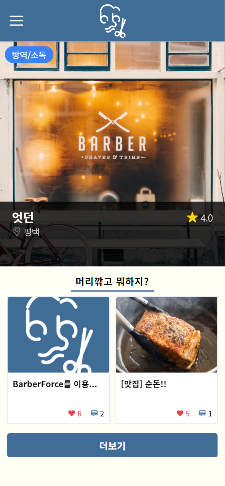
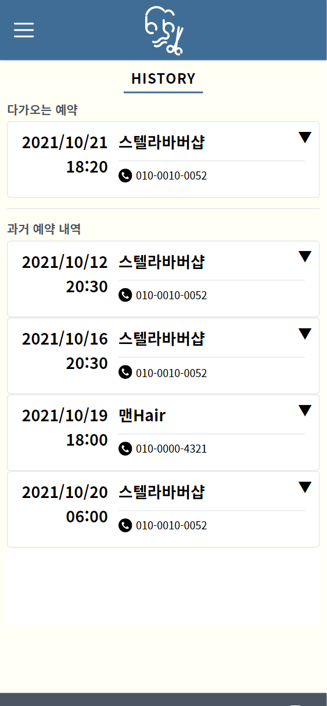
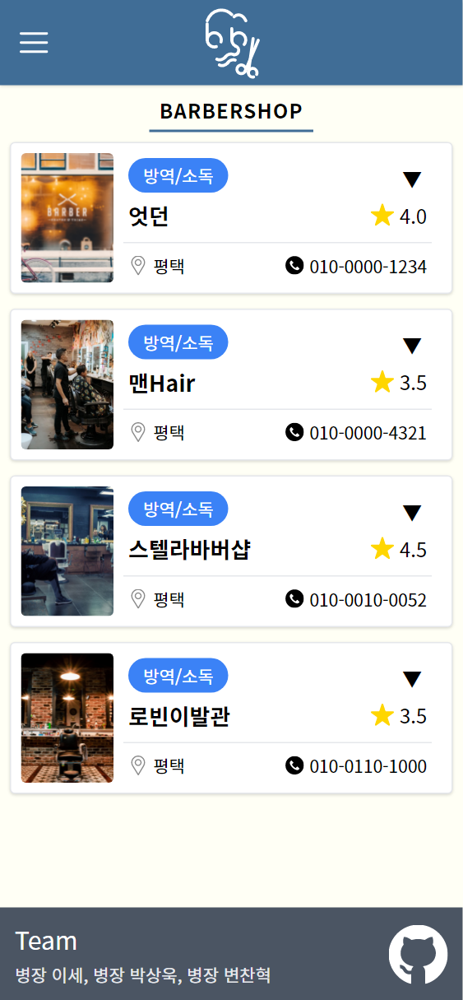
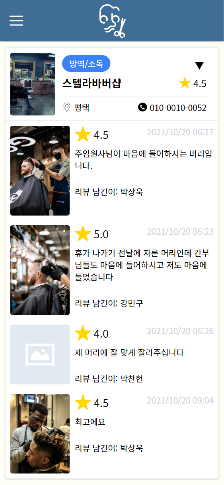
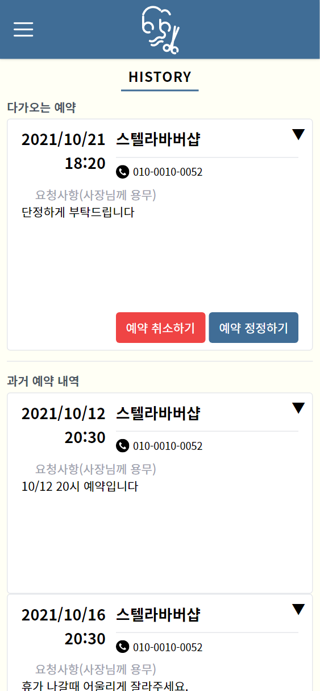
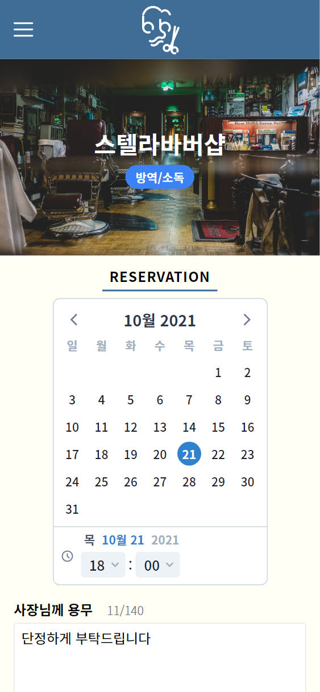
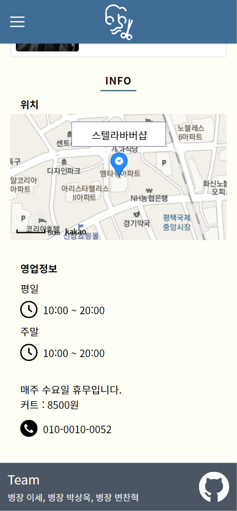
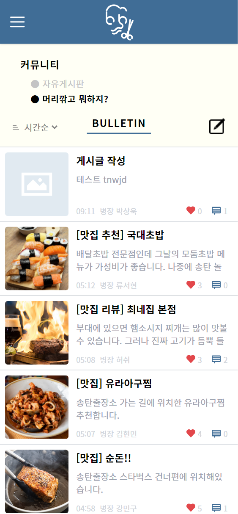
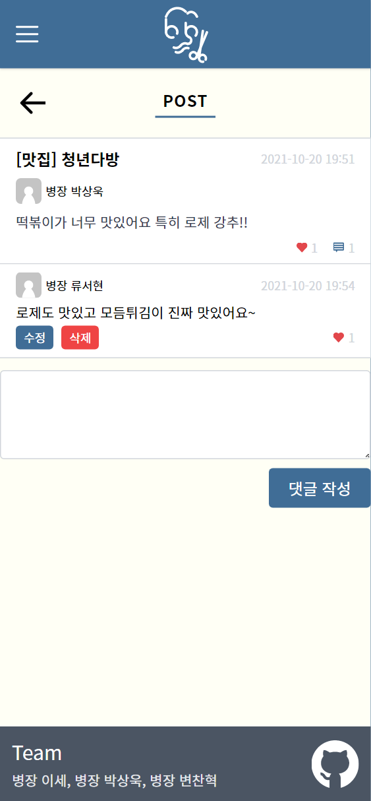
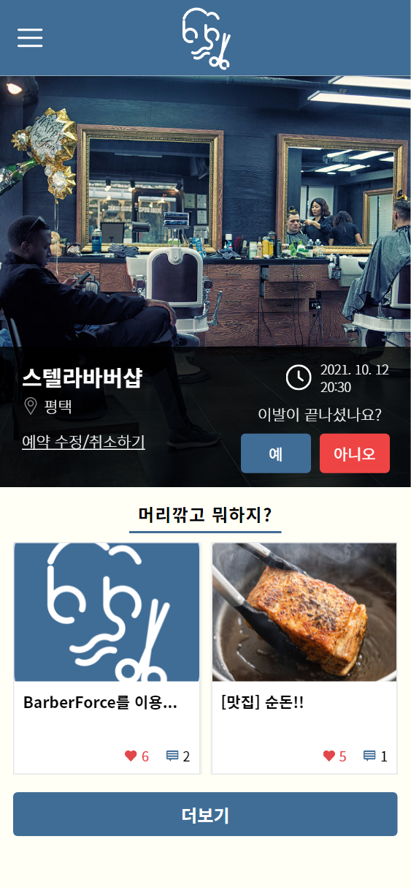

</Screenshots>

## 개요

공군 복무 중, 2021 군 장병 공개SW 해커톤에 "BarberForce - 군 장병 미용시설 예약 및 리뷰 웹 서비스"라는 주제로 참여하였습니다.

::: note 개발 기간
2021년 09월 ~ 2021년 10월
:::

## 인원

- 기획 1인, 백엔드 1인, **프론트엔드 1인** (총 3인)
- 프론트엔드 전반 및 백엔드 일부를 담당

## 주요 기능

- 

## 기술 스택

- Nuxt 2
- Vue 2

