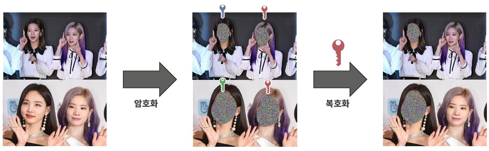
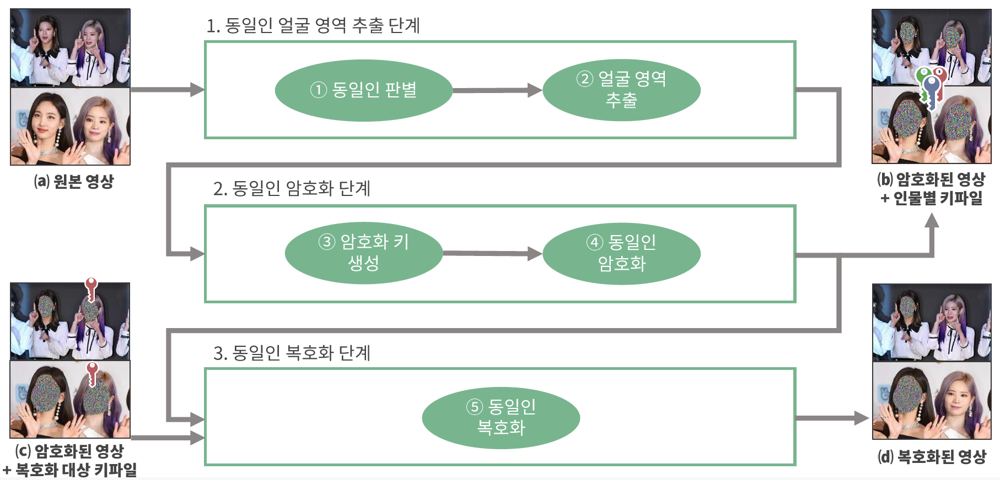
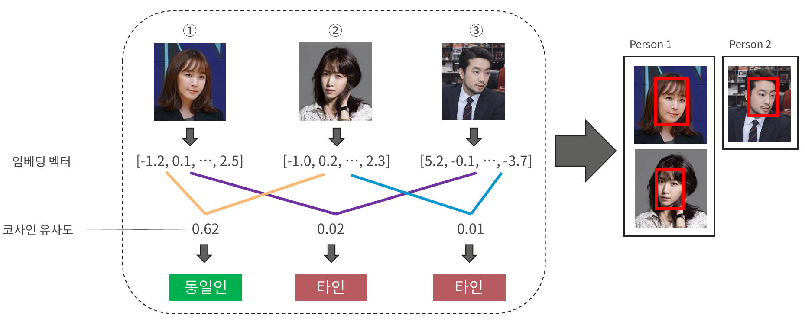

# 영상 내 동일인 얼굴 암호화 시스템 (2023-1,2)

> 컴퓨터공학공학설계1,2(2023-1,2) 과목에서 약 9개월간 4인 팀으로 개발했던 '영상 내 동일인 얼굴 암호화 시스템' 입니다. 

## 스크린샷

<!-- <Screenshots> -->

<!-- </Screenshots> -->

## 개요

'영상 내 동일인 얼굴 암호화 시스템'은 사용자가 입력한 영상 내 등장하는 인물의 얼굴들을 추출하고,
얼굴 간 유사도를 기준으로 동일인별로 그룹화한 뒤, 각 인물에 대해서 고유한 키를 사용하여 얼굴을 암/복호화하는 시스템입니다.

기존 영상 암호화 시스템과는 다르게 인물별로 암/복호화가 가능하다는 특징을 가진 시스템으로,
CCTV 영상 내 이상 행동자만을 식별하는 등의 활용이 가능합니다.

해당 프로젝트가 종료된 이후, '2023년도 겨울 ICIP&캡스톤디자인 결과발표회'에서 <TextHighlight>우수상</TextHighlight>을 수상하였습니다.

::: note 개발 기간
2023년 03월 ~ 2023년 12월 (2023-1,2학기)
:::

## 인원

- 개발 총 4인
- 얼굴 탐지 및 동일인 판별 모듈 담당

## 주요 기능

- 얼굴 탐지 및 동일인 판별 모듈
  - 영상 내 얼굴을 바운딩 박스 형태로 탐지
  - 각 얼굴 쌍의 유사도를 계산 후 동일인 여부를 판별하여 그룹화
- 얼굴 영역 추출 모듈
  - 바운딩 박스 형태의 얼굴 정보에서 실제 얼굴 영역을 추출
- 동일인별 얼굴 암호화 모듈
  - 인물 별 고유키 생성 및 암호화
  - 키와 대응되는 얼굴 영역 정보가 포함된 키 파일 생성
- 동일인별 얼굴 복호화 모듈
  - 키 파일에 대응되는 인물의 얼굴 복호화

## 기술 스택

- Machine Learning
- Python

