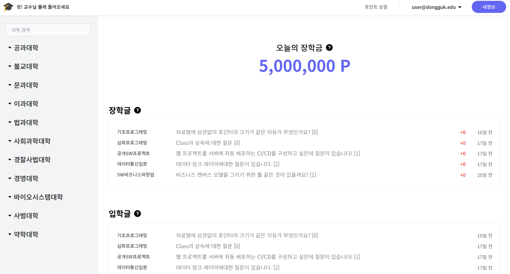

# 리워드 기반 대학생 QNA 플랫폼 (2022-2)

> 소프트웨어공학설계(2022-2) 과목에서 약 2개월간 4인 팀으로 개발했던 '리워드 기반 대학생 QNA 플랫폼' 입니다. 

## 스크린샷

<!-- <Screenshots> -->

<!-- 

 -->

<!-- </Screenshots> -->

## 개요

'리워드 기반 대학생 QNA 플랫폼'은 같은 학교 내 학우들과 학술적인 질문과 답변을 주고받으며
제휴 업체(학교 근처 카페 등)의 품목으로 교환할 수 있는 '포인트'를 얻을 수 있는 플랫폼입니다.

::: note 개발 기간
2022년 09월 ~ 2020년 10월 (2022-2학기)
:::

## 인원

- 백엔드 3인, 프론트엔드 1인 (총 4인)
- 프론트엔드 전반을 담당

## 주요 기능

- 회원 관리
  - 로그인/회원가입
  - 비밀번호 찾기/재설정(이메일 인증 방식)
- 학술 정보 QnA
  - 각 학과의 과목별 QnA 게시판 기능
    - 질문 CRUD (단, 질문이 달린 경우 삭제 불가)
      - 파일 첨부 기능
    - 답변 CRUD (단, 채택된 경우 삭제/수정 불가)
      - 파일 첨부 기능
    - 답변 추천 기능
- 포인트 분배
  - 매일 자정 당일의 총 장학금(포인트)을 당일 받은 추천수에 비례해 답변자들에게 분배
- 포인트 사용
  - 보유한 포인트를 사용해 제휴 상품의 쿠폰 구매
  - 구매한 쿠폰은 마이페이지에서 구매 내역 및 쿠폰 번호 조회 가능

## 기술 스택

- Nuxt 3
- Vue 3 (composition api)
- Typescript

